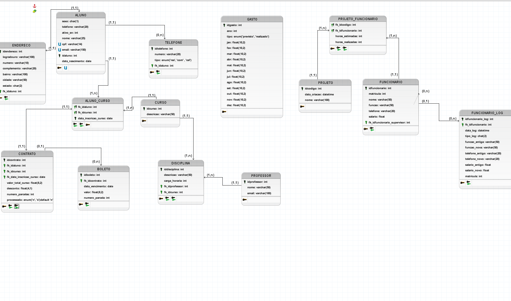

# 🎓 Sistema Universidade - Modelagem SQL

Projeto de banco de dados relacional desenvolvido em MySQL, simulando um sistema completo de gestão universitária, incluindo alunos, cursos, professores, contratos e controle financeiro.

---

## 📌 Objetivo

Este projeto foi criado com o objetivo de praticar e demonstrar conhecimentos em **SQL avançado**, incluindo modelagem de dados, consultas complexas e programação dentro do banco de dados.

---

## 🚀 Funcionalidades

* Cadastro de alunos, professores e cursos
* Matrícula de alunos em cursos
* Associação entre disciplinas e professores
* Geração de contratos e parcelas (boletos)
* Controle de dados financeiros
* Auditoria automática com triggers
* Relatórios com views

---

## 🧠 Conceitos aplicados

* Modelagem relacional
* Integridade referencial (Foreign Keys)
* JOINs (INNER, LEFT, RIGHT)
* Stored Procedures
* Functions
* Triggers
* Views
* Cursores (Cursor)
* Estruturas de repetição (WHILE, LOOP, REPEAT)
* Controle de fluxo (IF, CASE)

---

## 🗂️ Estrutura do Projeto

```bash
/sql
 ├── 01_schema.sql        # Criação do banco e tabelas
 ├── 02_inserts.sql       # Inserção de dados
 ├── 04_joins.sql         # Consultas com JOIN
 ├── 05_procedures.sql    # Procedures
 ├── 06_functions.sql     # Functions
 ├── 07_triggers.sql      # Triggers
 ├── 08_views.sql         # Views

```
📘 Dicionário de Dados

A documentação das tabelas e campos está disponível em:

📄 Versão para leitura: docs/descricao relacionamentos.png
📊 Versão completa: docs/dicionario_dados.xlsx

---
## 🧠 Modelo Entidade-Relacionamento (DER)

Este diagrama representa a estrutura do banco de dados, incluindo entidades, relacionamentos e chaves.



---

## ⚙️ Como executar o projeto

1. **Criar o banco e as tabelas**

```sql
01_schema.sql
```

2. **Inserir os dados**

```sql
02_inserts.sql
```

3. **Executar recursos adicionais**

```sql
05_procedures.sql
06_functions.sql
07_triggers.sql
08_views.sql
```

4. **Testar consultas**

```sql
04_joins.sql
```

---

## 📊 Exemplos de consultas

### 🔹 Listar alunos com seus telefones

```sql
SELECT 
    a.nome,
    t.numero
FROM aluno a
LEFT JOIN telefone t 
    ON a.idaluno = t.fk_idaluno;
```

---

### 🔹 Relacionar cursos, disciplinas e professores

```sql
SELECT 
    c.descricao AS curso,
    d.descricao AS disciplina,
    p.nome AS professor
FROM curso c
LEFT JOIN disciplina d 
    ON c.idcurso = d.fk_idcurso
LEFT JOIN professor p 
    ON d.fk_idprofessor = p.idprofessor;
```

---

## 🔥 Recursos avançados

Este projeto utiliza recursos mais avançados do MySQL, como:

* 📌 **Stored Procedures**

  * Automação de cálculos (ex: média ponderada)
  * Processamento de contratos

* 📌 **Triggers**

  * Auditoria de alterações na tabela de funcionários

* 📌 **Functions**

  * Cálculo de idade
  * Formatação de datas
  * Contagem de disciplinas por curso

* 📌 **Views**

  * Criação de relatórios otimizados

---

🚀 Tecnologias Utilizadas
MySQL
SQL
Modelagem Relacional

---

## 👨‍💻 Autor

**Marcos Vinícius de Jesus da Silva**

---

## 📎 Observações

Este projeto foi desenvolvido com foco em portfólio e demonstra a aplicação prática de conceitos de banco de dados em um cenário realista.
